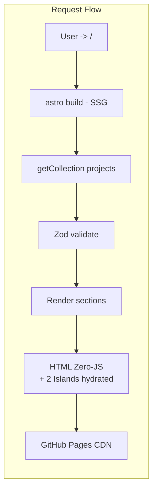

# ARCHITECTURE V2 — Tight Modular Portfolio (Refactor 2026)

> Giữ Astro + GitHub Pages + Command Center concept, nhưng siết chặt boundary để scale mà không vỡ.

## 1. Nguyên tắc

1.  **SSOT:** `docs/STRATEGY.md` (brand), `docs/DESIGN_SYSTEM.md` (token), `docs/CONTENT_GUIDE.md` (schema) là luật.
2.  **Dependency Rule (tầng dưới không biết tầng trên):** `ui` <- `sections` <- `pages`. `content` không được import `components`.
3.  **Content = Data:** Mọi dự án là `.mdx` tuân Zod, không chứa logic UI.
4.  **Islands riêng biệt:** Chỉ `interactive/*` được `client:*`, còn lại Zero-JS.

## 2. Tech Stack (giữ nguyên, đã chốt Phase 1)

| Layer | Tech | Ghi chú |
|---|---|---|
| Framework | Astro 6.4.8 | SSG, Content Layer `glob` |
| Style | Tailwind 4.3 + `@tailwindcss/vite` | token trong `global.css` |
| Content | `@astrojs/mdx` + `remark-math`/`rehype-katex` (KaTeX 0.16.11) | LaTeX cho Quant |
| Type | `astro/tsconfigs/strict` | |
| Deploy | GitHub Pages `deploy-pages@v4` | `site` + `base:/my-portfolio` |

## 3. Directory Structure V2 (chặt)

```text
/
├── docs/                         # SSOT - không code, chỉ rule
│   ├── STRATEGY.md
│   ├── ARCHITECTURE.md           # legacy (giữ để diff)
│   ├── ARCHITECTURE_V2.md        # file này
│   ├── DESIGN_SYSTEM.md
│   ├── CONTENT_GUIDE.md
│   └── frontend_skills/          # reference only
├── src/
│   ├── content.config.ts         # Zod schema duy nhất
│   ├── content/
│   │   └── projects/*.mdx        # DB: 5 files, mỗi file = 1 project
│   ├── lib/                      # NEW - pure logic, không import .astro
│   │   ├── constants.ts          # categoryMap, siteMeta, navLinks
│   │   ├── content.ts            # getSortedProjects(), filterByCategory()
│   │   ├── seo.ts                # buildSEO(), OG helpers
│   │   └── utils.ts              # cn(), formatDate(), getBaseUrl()
│   ├── components/
│   │   ├── ui/                   # ATOMIC - không biết business
│   │   │   ├── Badge.astro
│   │   │   ├── Button.astro
│   │   │   └── ThemeToggle.astro
│   │   ├── layout/               # SHELL - Header, Footer, Nav
│   │   │   ├── Header.astro      # tách từ MainLayout nav
│   │   │   └── Footer.astro      # đã có, chuyển vào layout/
│   │   ├── sections/             # COMPOSITE - business sections
│   │   │   ├── Hero.astro        # tách từ index.astro hero
│   │   │   ├── AboutMe.astro
│   │   │   ├── IntelligenceHub.astro
│   │   │   └── PortfolioRegistry.astro
│   │   └── interactive/          # ISLANDS - client:*
│   │       ├── HeatmapBackground.astro  # client:load
│   │       └── SystemTerminal.astro     # client:visible
│   ├── layouts/
│   │   ├── MainLayout.astro      # chỉ shell + SEO + slot
│   │   └── ProjectLayout.astro   # NEW - cho [slug].astro
│   ├── pages/
│   │   ├── index.astro           # chỉ compose sections
│   │   ├── projects/[slug].astro # dùng ProjectLayout
│   │   └── cluster/index.astro
│   └── styles/
│       └── global.css            # token + utilities
├── public/
│   └── images/
│       ├── avt.png               # cần nén <200KB WebP
│       └── projects/<slug>/*.webp # mỗi project 1 folder
├── astro.config.mjs
├── .mailmap
└── .github/workflows/deploy.yml
```

### Quy tắc import

```
pages  -> sections + layout + lib + content
sections -> ui + lib
layout -> ui + lib
interactive -> lib (không import sections)
lib -> không import .astro
content -> không import gì cả
```

## 4. Sơ đồ kiến trúc (Mermaid)

```mermaid
flowchart TB
  subgraph Docs[SSOT - docs/]
    STRAT[STRATEGY]
    DS[DESIGN_SYSTEM]
    CG[CONTENT_GUIDE]
    ARCH[ARCHITECTURE_V2]
  end

  subgraph Config[Config Layer]
    AC[astro.config.mjs]
    CC[src/content.config.ts\nZod Schema]
    TS[tsconfig.json]
  end

  subgraph Data[Data Layer]
    MDX[src/content/projects/*.mdx]
    LOADER[glob loader]
    ZOD{Zod validate}
    MDX --> LOADER --> ZOD
  end

  subgraph Lib[Logic Layer - src/lib/]
    CONST[constants.ts\ncategoryMap, nav]
    CONTENT[content.ts\ngetSortedProjects]
    SEO[seo.ts]
    UTILS[utils.ts]
  end

  subgraph UI[Component Layer]
    direction TB
    UI_ATOM[ui/\nBadge, Button, ThemeToggle]
    LAYOUT[layout/\nHeader, Footer]
    SECT[sections/\nHero, AboutMe, Hub, Registry]
    ISLAND[interactive/\nHeatmap, Terminal\nclient:*]
  end

  subgraph Pages[Page Layer]
    IDX[index.astro\ncompose sections]
    SLUG[projects/[slug].astro]
    CLUSTER[cluster/index.astro]
  end

  subgraph Deploy[Deploy]
    GH[GitHub Pages\ndeploy-pages@v4]
  end

  Docs -.-> Config
  Docs -.-> Lib
  Config --> Data
  Data --> Lib
  Lib --> UI
  UI --> Pages
  Pages --> GH
  AC --> GH

  style ZOD fill:#10b981,stroke:#fff,stroke-width:2px,color:#000
  style ISLAND fill:#0ea5e9,stroke:#fff,color:#000
```



## 5. Content Schema (chặt hơn)

Đã có ở `src/content.config.ts:9-38`, V2 bổ sung:

- `thumbnail` phải `/images/projects/<slug>/thumbnail.webp` (ép folder per project)
- `date` regex `YYYY-MM-DD` giữ nguyên
- `priority 1-10` dùng để sort, không cho trùng (sẽ thêm util kiểm tra duplicate)
- Thêm helper `src/lib/content.ts:validateUniquePriority()`

## 6. Migration Steps (đã làm / sẽ làm)

- [x] Phase 1: `package.json`, `.mailmap`, `audit fix`, `console.log` removal
- [ ] Phase 2: tạo `src/lib/` (bước tiếp theo trong commit này)
- [ ] Phase 3: tách `Header.astro` ra khỏi `MainLayout`, fix `snap` + dead link
- [ ] Phase 4: nén ảnh + thêm `@astrojs/sitemap`
- [ ] Phase 5: thêm `ProjectLayout.astro`, CI check `npm audit`

## 7. Quyết định giữ / bỏ

| Giữ | Bỏ / Đổi |
|---|---|
| Astro 6.4.8, Tailwind 4.3, MDX, KaTeX | `archive/` (sau khi verify) |
| Command Center dark token `#0a0a0a` | `snap-mandatory` toàn trang |
| `BASE_URL` logic | `| Space` title suffix |
| Content Layer glob | import lung tung giữa các tầng |

---
*V2 là bản siết chặt, không phải đập đi xây lại — mọi file cũ vẫn chạy, chỉ thêm boundary.*
