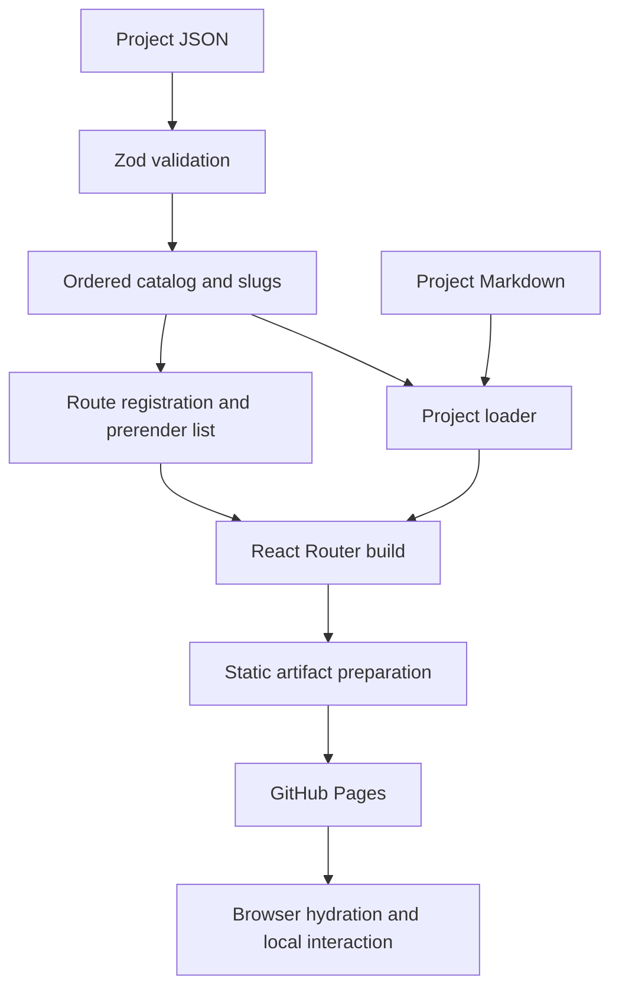

# Architecture

[Documentation index](../README.md)

Follow the application from validated content to static HTML and hydrated React components.

## Contents

- [System map](#system-map)
- [Boundaries](#boundaries)
- [Pages](#pages)
- [Source references](#source-references)
- [Related documents](#related-documents)

## System map

## Boundaries

`app/root.tsx` defines the HTML document, global assets and metadata; its `App` renders `SiteShell` around the route outlet. The shell owns navigation, shared footer, reveal effects and homepage video. Route modules compose feature components.

Catalog validation happens when the data module is imported. Project Markdown is eagerly imported as raw text. The build resolves published routes into HTML; browser state drives filters, strategy selection, terminal history and theme. These interactions do not write back to the catalog.

Shared logic in `src/lib/` is imported by React components and tests. The production artifact contains static files; the Node preview server is for local validation.

## Pages

This index introduces the architecture. Routing and rendering pages are linked here as they are added.

## Source references

- [app/root.tsx](../../app/root.tsx) — `export default function App` ([source line 44](https://github.com/ryantr-statinops/my-portfolio/blob/1ad473623a2d8cd3f1e5efe8831e539433543349/app/root.tsx#L44)).
- [app/components/layout/SiteShell.tsx](../../app/components/layout/SiteShell.tsx) — `export default function SiteShell` ([source line 9](https://github.com/ryantr-statinops/my-portfolio/blob/1ad473623a2d8cd3f1e5efe8831e539433543349/app/components/layout/SiteShell.tsx#L9)).
- [app/data/projects.ts](../../app/data/projects.ts) — `projectCatalogSchema.parse` ([source line 4](https://github.com/ryantr-statinops/my-portfolio/blob/1ad473623a2d8cd3f1e5efe8831e539433543349/app/data/projects.ts#L4)).

## Related documents

- [Project overview](../overview.md)
