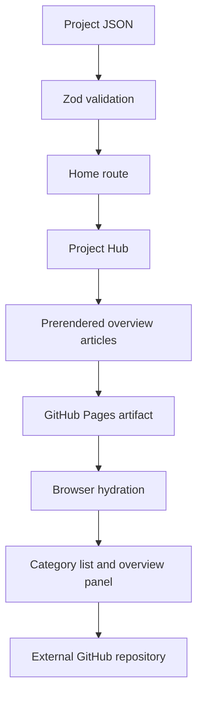

# Architecture

[Documentation index](../README.md)

Follow JSON overviews from import-time validation to the static page and browser state.

## Contents

- [System map](#system-map)
- [Boundaries](#boundaries)
- [Pages](#pages)
- [Source references](#source-references)
- [Related documents](#related-documents)

## System map

## Boundaries

root.tsx owns the HTML document, assets, metadata and SiteShell around the outlet. SiteShell owns navigation, shared footer, background media and reveal behavior. Home passes parsed project records into ProjectHub. Filtering and selection helpers are pure functions.

The catalog is imported at build time and bundled for the browser; nothing fetches GitHub data at runtime. No secret is needed. The static fallback exposes every overview before JavaScript activates list/panel controls.

## Pages

- [Routing](routing.md)
- [Rendering and artifacts](rendering.md)

## Source references

- [app/root.tsx](../../app/root.tsx) — `export default function App` ([line 43](https://github.com/ryantr-statinops/my-portfolio/blob/24efc0ca6734fc406153cc5b291764af915cda52/app/root.tsx#L43)).
- [app/data/projects.ts](../../app/data/projects.ts) — `export const projects` ([line 4](https://github.com/ryantr-statinops/my-portfolio/blob/24efc0ca6734fc406153cc5b291764af915cda52/app/data/projects.ts#L4)).
- [app/data/project-hub.ts](../../app/data/project-hub.ts) — `export function projectsForCategory` ([line 5](https://github.com/ryantr-statinops/my-portfolio/blob/24efc0ca6734fc406153cc5b291764af915cda52/app/data/project-hub.ts#L5)).

## Related documents

- [Source map](../reference/code-map.md)
