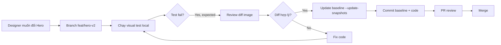

# Layer 3 — Visual Regression (Hero Palette Guard)

> **Mục đích:** Phát hiện thay đổi thị giác ngoài ý muốn ở khu vực Hero — nơi đã có 3 lần revert trong 7 ngày qua.

---

## 1. Bối cảnh (Context)

Git history cho thấy Hero là "vùng nóng":
```
57922a9 revert: restore heatmap palette sync #00f2ff #0ea5e9 #93f8d8
83b0f37 revert(main): restore HeatmapBackground to pre-palette-sync
036b9d3 revert(hero): restore CTA pill and change rounded-full to rounded-xl
```
Mỗi lần revert = một feature đã merge → gây regression → phải lùi. Visual test sẽ **block** những thay đổi ngoài ý muốn ngay khi chạy CI.

## 2. Mục tiêu (Goals)

- Snapshot Hero section ở 3 viewport: Desktop (1280x800), Tablet (768x1024), Mobile (375x667).
- So sánh pixel với baseline; cho phép sai lệch tối đa 100 pixels.
- Chỉ test vùng Hero (không full page) để giảm false positive từ animation hoặc dynamic content khác.
- Khi designer/owner muốn thay đổi Hero **hợp lệ** → update baseline có chủ đích.

## 3. Vùng test (Scope Boundaries)

### ✅ Test
- `h1` (tiêu đề chính — hiện tại "INFRASTRUCTURE")
- "CURRENT FOCUS" header
- "EXPLORE" header (nếu có)
- CTA buttons (VIEW PROFILE, VIEW PROJECTS)
- HeatmapBackground palette (3 màu `#00f2ff`, `#0ea5e9`, `#93f8d8`)

### ❌ Không test
- Hiệu ứng animation/transition (Playwright tự pause)
- Phần bên dưới Hero (Bento grid, footer)
- Random/seeded content
- Time-based elements

## 4. Test Cases

### 4.1. Hero desktop snapshot
```ts
test('Hero desktop matches baseline', async ({ page }) => {
  await page.setViewportSize({ width: 1280, height: 800 })
  await page.goto('/')
  await page.waitForLoadState('networkidle')
  const hero = page.locator('section').first()
  await expect(hero).toHaveScreenshot('hero-desktop.png', {
    maxDiffPixels: 100,
    animations: 'disabled',
  })
})
```

### 4.2. Hero mobile snapshot
```ts
test('Hero mobile matches baseline', async ({ page }) => {
  await page.setViewportSize({ width: 375, height: 667 })
  await page.goto('/')
  await page.waitForLoadState('networkidle')
  const hero = page.locator('section').first()
  await expect(hero).toHaveScreenshot('hero-mobile.png', {
    maxDiffPixels: 100,
  })
})
```

### 4.3. CTA button hover state
```ts
test('CTA hover state', async ({ page }) => {
  await page.goto('/')
  const cta = page.getByRole('link', { name: /view projects/i }).first()
  await cta.hover()
  await page.waitForTimeout(300) // chờ transition
  await expect(cta).toHaveScreenshot('cta-hover.png', {
    maxDiffPixels: 50,
  })
})
```

### 4.4. Heatmap palette tokens
```ts
test('Heatmap palette uses #00f2ff, #0ea5e9, #93f8d8', async ({ page }) => {
  await page.goto('/')
  // Lấy màu từ CSS variables
  const colors = await page.evaluate(() => {
    const styles = getComputedStyle(document.documentElement)
    return {
      primary: styles.getPropertyValue('--color-primary').trim(),
      secondary: styles.getPropertyValue('--color-secondary').trim(),
      accent: styles.getPropertyValue('--color-accent').trim(),
    }
  })
  expect(colors.primary.toLowerCase()).toBe('#00f2ff')
  expect(colors.secondary.toLowerCase()).toBe('#0ea5e9')
  expect(colors.accent.toLowerCase()).toBe('#93f8d8')
})
```

## 5. Baseline Management

### 5.1. Tạo baseline lần đầu
```bash
# Chạy local với flag update
npx playwright test tests/e2e/visual.spec.ts --update-snapshots
```

### 5.2. File baseline
```
tests/e2e/visual.spec.ts-snapshots/
├── hero-desktop-chromium-linux.png
├── hero-mobile-chromium-linux.png
├── cta-hover-chromium-linux.png
```

> **Lưu ý:** Filename chứa platform (`chromium-linux`). Khi chạy trên macOS local sẽ tạo file khác. → Cần cấu hình `snapshotPathTemplate` để chuẩn hóa.

### 5.3. Khi nào update baseline

| Tình huống | Hành động |
|-----------|-----------|
| Redesign Hero có chủ đích | Update baseline, commit file mới |
| Thay đổi palette (màu mới) | Update baseline + update `04-ci-integration.md` nếu dùng token test |
| False positive (font rendering) | Tăng `maxDiffPixels` hoặc disable font preload, KHÔNG update baseline |

## 6. Implementation Plan

### 6.1. Cấu hình Playwright snapshot chuẩn hóa
Trong `playwright.config.ts`:
```ts
export default defineConfig({
  snapshotPathTemplate: '{testDir}/__snapshots__/{testFilePath}/{arg}-{projectName}{ext}',
})
```

### 6.2. File test `tests/e2e/visual.spec.ts`
Kết hợp 4 test cases ở trên.

### 6.3. Setup CI cache
```yaml
- name: Cache Playwright Browsers
  uses: actions/cache@v4
  with:
    path: ~/.cache/ms-playwright
    key: ${{ runner.os }}-playwright-${{ hashFiles('package-lock.json') }}
- name: Install Playwright
  run: npx playwright install --with-deps chromium
```

## 7. Acceptance Criteria

- [ ] Baseline screenshot tạo thành công trên CI lần đầu.
- [ ] Thay đổi 1 pixel ở Hero CTA → test fail với diff image.
- [ ] Thay đổi palette hex → test fail ngay.
- [ ] `maxDiffPixels: 100` không gây false positive do anti-aliasing.

## 8. Risks & Mitigation

| Risk | Mitigation |
|------|-----------|
| Font rendering khác nhau giữa OS | Dùng `--font-render-hinting=none`, container cố định `font-family: monospace` cho text quan trọng. |
| Animation gây flicker | `animations: 'disabled'` + `waitForLoadState('networkidle')` + `waitForTimeout(500)`. |
| CI runner khác local (Ubuntu vs macOS) | Snapshots theo platform — chấp nhận 2 baseline nếu cần. |
| Background gradient shift | Chỉ test container của Hero, không full page. |

## 9. Quy trình khi muốn redesign Hero



## 10. Out of scope

- Dark/Light mode toggle test (chỉ test default).
- Animation chuyển trang.
- Test các page khác ngoài Hero.
- A/B test multi-variant.
