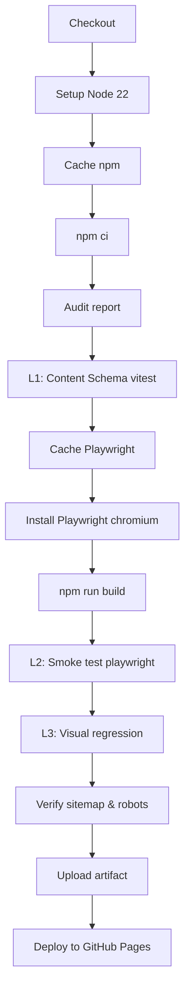

# Layer 4 — CI Integration (GitHub Actions)

> **Mục đích:** Kết nối 3 layer test (Schema, Smoke, Visual) vào workflow `.github/workflows/deploy.yml` hiện có, đảm bảo mọi push lên `main` đều pass trước khi deploy.

---

## 1. Workflow hiện tại (Current State)

File `.github/workflows/deploy.yml`:
- Trigger: `push` to `main`, `workflow_dispatch`
- 2 jobs: `build` (test + build + verify) → `deploy` (GitHub Pages)

**Điểm yếu:**
- Job `build` chỉ chạy `npm run build` + `test -f dist/index.html`.
- Không có unit test, smoke test, hay visual regression.

## 2. Mục tiêu (Goals)

- Thêm **3 bước test** tuần tự vào job `build` trước khi upload artifact.
- Mỗi test fail → block deploy.
- Tổng thời gian CI < 3 phút (mục tiêu), giữ timeout hợp lý.
- Cache dependencies + Playwright browser để tăng tốc.

## 3. Pipeline mới (Proposed)



## 4. Workflow mới (Full YAML)

```yaml
name: Deploy to GitHub Pages

on:
  push:
    branches: [main]
  workflow_dispatch:

permissions:
  contents: read
  pages: write
  id-token: write

concurrency:
  group: "pages"
  cancel-in-progress: false

jobs:
  build:
    runs-on: ubuntu-latest
    timeout-minutes: 10
    steps:
      - name: Checkout
        uses: actions/checkout@v4

      - name: Setup Node
        uses: actions/setup-node@v4
        with:
          node-version: 22
          cache: npm

      - name: Install dependencies
        run: npm ci

      - name: Audit (report only)
        run: npm audit --audit-level=moderate || echo "::warning:: audit has vulnerabilities"
        continue-on-error: true

      # ===== Layer 1: Content Schema =====
      - name: L1 - Content schema validation
        run: npm run test:unit

      # ===== Layer 2 + 3 cần Playwright =====
      - name: Cache Playwright Browsers
        uses: actions/cache@v4
        with:
          path: ~/.cache/ms-playwright
          key: ${{ runner.os }}-playwright-${{ hashFiles('package-lock.json') }}
          restore-keys: |
            ${{ runner.os }}-playwright-

      - name: Install Playwright
        run: npx playwright install --with-deps chromium

      - name: Build
        run: npm run build

      # ===== Layer 2: Smoke Test =====
      - name: L2 - Smoke test (routing & HTTP)
        run: npm run test:smoke

      # ===== Layer 3: Visual Regression =====
      - name: L3 - Visual regression
        run: npm run test:visual
        env:
          CI: true

      # ===== Verify output =====
      - name: Verify sitemap & robots
        run: |
          ls -lh dist/sitemap-index.xml dist/sitemap-0.xml dist/robots.txt
          test -f dist/index.html && echo "build ok 7 pages"

      - name: Upload Pages artifact
        uses: actions/upload-pages-artifact@v3
        with:
          path: 'dist'

  deploy:
    needs: build
    runs-on: ubuntu-latest
    environment:
      name: github-pages
      url: ${{ steps.deployment.outputs.page_url }}
    steps:
      - name: Deploy to GitHub Pages
        id: deployment
        uses: actions/deploy-pages@v4
```

## 5. Scripts bổ sung cho `package.json`

```json
{
  "scripts": {
    "dev": "astro dev",
    "build": "astro build",
    "preview": "astro preview",
    "astro": "astro",
    "test": "npm run test:unit && npm run test:smoke && npm run test:visual",
    "test:unit": "vitest run",
    "test:smoke": "playwright test tests/e2e/smoke.spec.ts",
    "test:visual": "playwright test tests/e2e/visual.spec.ts"
  }
}
```

## 6. Các biến môi trường (Environment Variables)

| Biến | Mục đích | Set ở đâu |
|------|----------|-----------|
| `CI=true` | Bật strict mode cho Playwright (no `reuseExistingServer`, fail on `test.only`) | Auto bởi GitHub Actions |
| `BASE_URL` | Base URL cho Playwright (mặc định `http://localhost:4321` từ `playwright.config.ts`) | Có thể override nếu cần test trên Pages preview |
| `PLAYWRIGHT_TEST_BASE_URL` | Override baseURL | Optional |

## 7. Caching Strategy

### 7.1. npm modules
- Đã có sẵn qua `actions/setup-node@v4` + `cache: npm`.

### 7.2. Playwright browsers
- `~/.cache/ms-playwright` ~ 300MB.
- Cache key: `${{ runner.os }}-playwright-${{ hashFiles('package-lock.json') }}`.
- Khi `package.json` đổi version Playwright → cache miss → re-install.

### 7.3. Astro build output
- Không cache — mỗi build phải fresh để phát hiện regression sớm.

## 8. Timing Budget

| Bước | Ước tính | Tối đa |
|------|----------|--------|
| Checkout | 5s | 10s |
| npm ci | 20s | 60s |
| Audit | 5s | 15s |
| L1 Schema | 2s | 10s |
| Playwright install (cache hit) | 10s | 30s |
| Playwright install (cache miss) | 60s | 120s |
| Build | 7s | 30s |
| L2 Smoke | 30s | 90s |
| L3 Visual | 60s | 120s |
| Verify | 2s | 5s |
| Upload artifact | 5s | 15s |
| **Tổng** | **~3 phút** | **~8 phút** |

## 9. Failure Handling

### 9.1. L1 fail (schema)
- Action: Stop ngay, không chạy build.
- Common cause: MDX thiếu field, date format sai.

### 9.2. L2 fail (smoke)
- Action: Stop ngay, không upload artifact.
- Common cause: Slug rename, page 500, broken link.

### 9.3. L3 fail (visual)
- Action: Stop, attach diff image làm artifact.
- Common cause: Palette thay đổi, layout shift.

### 9.4. Cấu hình upload diff image
```yaml
- name: Upload Playwright artifacts on failure
  if: failure()
  uses: actions/upload-artifact@v4
  with:
    name: playwright-report
    path: |
      test-results/
      playwright-report/
    retention-days: 7
```

## 10. Local Development Workflow

```bash
# Chạy nhanh schema test (không cần build)
npm run test:unit

# Chạy smoke test (cần build trước)
npm run build && npm run test:smoke

# Chạy visual test với update baseline
npx playwright test tests/e2e/visual.spec.ts --update-snapshots

# Watch mode cho schema test
npm run test:watch

# Tất cả test
npm test
```

## 11. Pre-commit Hook (Optional)

Thêm Husky + lint-staged để chạy L1 trước khi commit:

```bash
npx husky add .husky/pre-commit "npm run test:unit"
```

> **Lưu ý:** Không nên chạy L2/L3 ở pre-commit vì chậm (cần build + browser).

## 12. Acceptance Criteria

- [ ] Workflow chạy thành công trên push đầu tiên sau khi merge.
- [ ] Khi L1 fail → workflow dừng, log chỉ rõ file MDX nào sai.
- [ ] Khi L2 fail → workflow dừng, log chỉ route nào 404/500.
- [ ] Khi L3 fail → workflow dừng, diff image attach vào run.
- [ ] Tổng thời gian CI < 3 phút khi cache hit.
- [ ] Có thể debug local bằng `act` (https://github.com/nektos/act) nếu cần.

## 13. Out of scope

- Matrix testing (Node 18, 20, 22) — chỉ dùng Node 22.
- Deploy preview cho PR — GitHub Pages free không hỗ trợ.
- Slack/Discord notification khi fail.
- Auto-retry khi Playwright flake (chỉ retry 2 lần trong CI).
