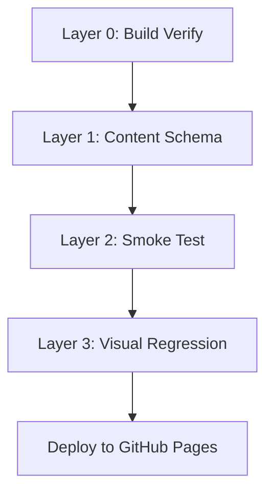

# Test Plan — my-portfolio

> **Project:** Ryan Tran — Command Center Portfolio (Astro + Tailwind + MDX)
> **Owner:** Ryan Tran
> **Repo:** `ryantr-statinops/my-portfolio`
> **Production URL:** `https://ryantr-statinops.github.io/my-portfolio/`
> **Stack:** Astro 6.4.8 · Tailwind 4.3 · MDX · GitHub Pages CI/CD

---

## 1. Mục tiêu (Goals)

1. **Ngăn chặn regression** ở những khu vực đã có tiền sử đổi/đảo ngược lặp đi lặp lại (Hero CTA, Heatmap palette, layout snap).
2. **Bảo vệ data integrity** của Content Collections (5 MDX project, Zod schema nghiêm ngặt).
3. **Đảm bảo deploy không vỡ** ở tầng visual + structural trước khi public users truy cập.
4. **Tạo safety net** cho AI-assisted development — khi LLM sinh code mới, test sẽ là "tấm lưới" phát hiện sai lệch sớm.
5. **Giữ chi phí bảo trì thấp** — test plan phải lightweight, phù hợp quy mô portfolio cá nhân.

---

## 2. Nguyên tắc (Principles)

| Nguyên tắc | Áp dụng |
|------------|---------|
| **Proportionality** | Đầu tư test tỉ lệ thuận với rủi ro, không test mọi thứ. |
| **Shift-left** | Test chạy càng sớm trong CI càng tốt (trước khi deploy). |
| **No flaky tests** | Ưu tiên deterministic test; visual diff chỉ dùng khi thật cần. |
| **Fast feedback** | Toàn bộ CI test < 2 phút. |
| **Documentation as code** | Test plan là Markdown, version-controlled cùng source. |

---

## 3. Phạm vi (Scope)

### ✅ In-scope (sẽ test)
- **Build pipeline** — Astro static generation phải thành công và tạo đúng 7 pages.
- **Content schema** — 5 file MDX trong `src/content/projects/` phải pass Zod schema.
- **Routing smoke test** — 7 routes (`/`, `/cluster/`, 5 project pages) phải trả 200 OK.
- **Sitemap & SEO assets** — `sitemap-index.xml`, `sitemap-0.xml`, `robots.txt` phải tồn tại.
- **Visual regression Hero** — snapshot khu vực Hero (CTA, headings, CURRENT FOCUS) trên `main`.
- **Metadata integrity** — OG tags, canonical URL, Twitter card trên mỗi page.

### ❌ Out-of-scope (sẽ KHÔNG test)
- Cross-browser compatibility (chỉ test Chromium mặc định).
- Full E2E user flows (login, form submission, v.v.) — portfolio không có.
- Performance benchmarking chi tiết (Lighthouse manual thay vì auto test).
- Unit test cho toàn bộ `src/lib/` — chỉ test nếu chứa business logic quan trọng.
- Accessibility đầy đủ (axe-core) — chỉ kiểm tra semantic cơ bản.

---

## 4. Test Layers (tóm tắt)

| Layer | Mục đích | Công cụ | Thời gian | Trạng thái |
|-------|----------|---------|-----------|-----------|
| L0 — Build | HTML files tồn tại | Bash + `ls` | ~5s | ✅ Có sẵn |
| L1 — Content Schema | MDX hợp lệ | Vitest + Zod | ~2s | 🆕 Sẽ thêm |
| L2 — Smoke Test | 7 routes → 200 | Playwright | ~30s | 🆕 Sẽ thêm |
| L3 — Visual Regression | Hero không lệch | Playwright `toHaveScreenshot` | ~1min | 🆕 Sẽ thêm |

---

## 5. Lịch trình triển khai (Roadmap)

### Phase 1 — Quick wins (tuần này)
- [x] Viết test plan docs (file này)
- [ ] Setup Vitest + L1 (content schema)
- [ ] Thêm L1 vào CI
- [ ] Smoke test tự động chạy khi push `main`

### Phase 2 — Hero guard (tuần sau)
- [ ] Setup Playwright + Chromium
- [ ] Tạo baseline screenshot cho Hero
- [ ] Thêm L3 vào CI workflow
- [ ] Document cách update baseline khi redesign hợp lệ

### Phase 3 — Polish (ongoing)
- [ ] Theo dõi flake rate của L3
- [ ] Thêm SEO meta test nếu cần
- [ ] Đánh giá lại chi phí/lợi ích định kỳ

---

## 6. Tiêu chí thành công (Success Metrics)

- ✅ CI fail chính xác khi MDX sai schema (không false positive).
- ✅ Visual regression phát hiện 100% sự thay đổi palette Hero (mục tiêu dựa trên 3 lần revert gần đây).
- ✅ Smoke test fail ngay khi rename slug mà quên update internal link.
- ✅ Tổng thời gian CI không tăng quá 90 giây.
- ✅ Developer có thể chạy test local trong < 30 giây.

---

## 7. Rủi ro & Mitigation

| Rủi ro | Mức độ | Mitigation |
|--------|--------|-----------|
| Visual test quá nhạy (font rendering khác CI vs local) | Trung bình | Dùng `maxDiffPixels: 100`, container cố định, font preload. |
| CI timeout do Playwright download | Thấp | Cache `~/.cache/ms-playwright` qua `actions/cache@v4`. |
| Team member vô tình update baseline sai | Thấp | Yêu cầu review PR chứa thay đổi file baseline. |
| Test quá nhiều → bỏ qua | Thấp | Giữ tổng test < 20 case, output CI rõ ràng. |

---

## 8. Tài liệu liên quan (Related Docs)

- `docs/ARCHITECTURE.md` — Tech stack và directory structure
- `docs/MIGRATION_PLAN.md` — Lịch sử migration từ archive
- `docs/plan/01-content-schema.md` — Chi tiết Layer 1
- `docs/plan/02-smoke-test.md` — Chi tiết Layer 2
- `docs/plan/03-visual-regression.md` — Chi tiết Layer 3
- `docs/plan/04-ci-integration.md` — Tích hợp vào GitHub Actions

---

## 9. Quyết định thiết kế (Design Decisions)

1. **Tại sao không dùng Cypress?** Playwright nhanh hơn, support tốt hơn cho static site + screenshot diff.
2. **Tại sao tách Vitest riêng?** Build-time check Zod đã có, nhưng test layer giúp phát hiện regression sớm hơn và document expectations.
3. **Tại sao test trên `main` mà không phải mỗi PR?** Vì portfolio deploy trực tiếp từ `main`, CI của GitHub Pages đã chạy trên mỗi push — gộp luôn để giảm duplicate runs.
4. **Tại sao không dùng Lighthouse CI?** Astro đã tối ưu sẵn; thêm Lighthouse sẽ tăng CI time mà ít giá trị thêm cho portfolio.

---

*File này là entry point. Đọc tiếp `01-content-schema.md` → `04-ci-integration.md` để hiểu chi tiết từng layer.*
