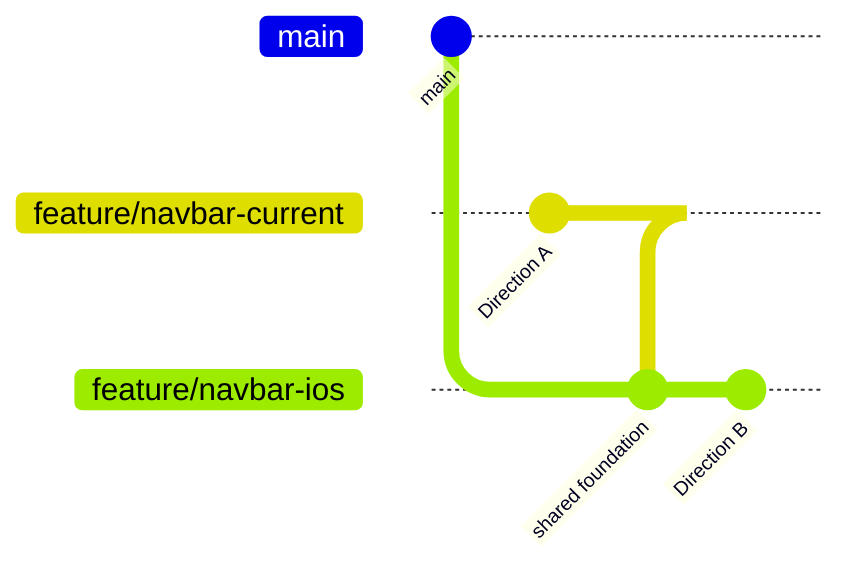

# Navbar Dual-Variant Plan

> **Goal:** Refactor inline navbar in `MainLayout.astro` into two parallel components, each on its own branch. Direction A preserves the current Command Center look; Direction B adopts iOS 17/18 compact tab bar style. Both share mobile hamburger overlay + accessibility baseline.

---

## 1. Context (verified from code)

- **Current navbar:** inline in `src/layouts/MainLayout.astro:64-84`, fixed top, `glass border-b`, 4 anchor links to `/#about-me`, `/#intelligence-hub`, `/#projects`, `/#connect`, `ThemeToggle` on the right.
- **Section IDs in DOM:**
  - `about-me` — declared twice (`src/pages/index.astro:76` AND `src/components/AboutMe.astro:9` inside the wrapper). Duplicate but not breaking.
  - `intelligence-hub` — `src/pages/index.astro:81`.
  - `projects` — `src/pages/index.astro:88`.
  - `connect` — `src/components/Footer.astro:4` (different component, same page).
- **Theme tokens:** defined in `src/styles/global.css:18-44`. Light: `--primary: #0a0a0a`, Dark: `--primary: #ffffff`, accent cyan `#00f2ff` (dark) / `#0088cc` (light).
- **Base path:** `astro.config.mjs:12` = `/my-portfolio` — all links must use `import.meta.env.BASE_URL` prefix when not pure hash anchor on same page.
- **No existing Navbar component.** Folder `src/components/layout/` exists but is empty.
- **No JS framework.** Astro inline `<script>` only.

## 2. Decisions (locked)

| Decision | Value | Why |
|----------|-------|-----|
| Mobile form | Top hamburger → full-screen overlay | Per user answer |
| iOS reference | iOS 17/18 compact tab bar (mixed: glass pill + segmented feel) | Per user answer |
| Items | Keep 4: IDENTITY, STRATEGY, PROJECTS, CONNECT | Per user answer |
| Hover | Color change only (`hover:text-primary`) | Per user answer |
| JS | Vanilla inline, no Alpine | Per user answer |
| Parallelism | 2 feature branches, each ships independently | Per user answer |

## 3. Two directions

### 3.1 Direction A — "Current Command Center" (preserve + harden)
Preserve visual identity; fix structural gaps.

**Visual:**
- Same fixed top bar, `glass border-b border-border`.
- Logo (40x40 avatar + "Ryan Tran" text on `sm+`).
- 4 anchor links, `font-mono uppercase tracking-widest text-[11px]` (upgraded from 9px).
- `ThemeToggle` on right.
- Mobile: hamburger button replaces links, opens full-screen overlay.

**Functional additions (tận dụng A từ option A):**
- Tách thành `src/components/layout/Navbar.astro`.
- Skip-to-content link (visually hidden, keyboard accessible).
- `aria-label="Primary"`, `aria-current="page"` on active link.
- Mobile overlay with focus trap + ESC to close.
- Scrollspy via single `IntersectionObserver` shared with mobile menu.

**Branch:** `feature/navbar-current`

### 3.2 Direction B — "iOS 17/18 Compact Tab"
Apply iOS compact tab bar DNA: glass pill, segmented feel, less mono.

**Visual:**
- Fixed top, but container is a **floating pill** (`mx-4 mt-3 rounded-full`) with stronger glass (`backdrop-blur-2xl bg-card/30`).
- Links inside pill separated by `divide-x divide-border/50`.
- Font switches to `font-sans text-[13px] font-medium` (San Francisco-like). Drop `[ BRACKET ]` decoration.
- Logo simplified: only avatar circle (40x40) on left, no text.
- Active item: subtle background pill `bg-foreground/5 rounded-full` + slight scale.
- `ThemeToggle` inside the right edge of pill.
- Mobile: same hamburger overlay (shared pattern), but with iOS-style blur backdrop and rounded corners.

**Functional additions (tận dụng D — command palette optional, deferred):**
- Same scrollspy, same a11y baseline as Direction A.
- **Deferred to follow-up:** Cmd+K command palette (mentioned in original option D). Not in scope for v1.

**Branch:** `feature/navbar-ios`

## 4. Shared foundation (build once, reuse in both)

Create in `main` (or in both branches with identical content) before splitting:

### 4.1 `src/components/layout/Navbar.types.ts`
```ts
export type NavItem = {
  label: string;
  href: string;        // e.g. "/#about-me" or absolute path
  sectionId: string;   // e.g. "about-me" — used by scrollspy
}
export const NAV_ITEMS: NavItem[] = [
  { label: "IDENTITY",  href: "/#about-me",         sectionId: "about-me" },
  { label: "STRATEGY",  href: "/#intelligence-hub", sectionId: "intelligence-hub" },
  { label: "PROJECTS",  href: "/#projects",         sectionId: "projects" },
  { label: "CONNECT",   href: "/#connect",          sectionId: "connect" },
];
```

### 4.2 `src/components/layout/MobileOverlay.astro`
- Full-screen overlay, `fixed inset-0 z-40`, glass background.
- Hamburger trigger in `Navbar.astro` toggles `data-open` on overlay.
- Inline script: ESC closes, focus moves to first link, body scroll lock via `overflow-hidden` on `<html>`.
- Reused by both Direction A and B.

### 4.3 `src/components/layout/ScrollSpy.astro`
- One `<script>` block reading `NAV_ITEMS` and observing section IDs.
- Toggles `aria-current="true"` + `data-active="true"` on matching `<a>`.
- Threshold: `[0, 0.25, 0.5, 0.75, 1]`, picks the section with highest ratio currently visible.

## 5. File layout

```
src/components/layout/
├── Navbar.types.ts          # shared
├── MobileOverlay.astro      # shared
├── ScrollSpy.astro          # shared (script-only)
├── Navbar.current.astro     # Direction A
└── Navbar.ios.astro         # Direction B
```

`MainLayout.astro` imports one of `Navbar.current` or `Navbar.ios` plus the shared `MobileOverlay` + `ScrollSpy`.

## 6. Branching & merge strategy



- Both branches share identical `*.types.ts`, `MobileOverlay.astro`, `ScrollSpy.astro` content. Implemented twice intentionally to keep branches independent (no merge dependency).
- After both PRs open, user A/B-compares on GitHub Pages preview URLs.
- Winner gets merged first; loser either cherry-picked improvements or closed.

## 7. Implementation tasks (ordered)

### Common (per branch)
1. Create `src/components/layout/` directory if missing.
2. Write `Navbar.types.ts` with `NAV_ITEMS` array.
3. Write `MobileOverlay.astro` (overlay markup + toggle script).
4. Write `ScrollSpy.astro` (script-only component).
5. Write branch-specific `Navbar.<variant>.astro`.
6. Update `MainLayout.astro:64-84` to import new component (replace inline nav).
7. `npm run build` locally — verify 7 pages still generated.
8. Verify `dist/index.html` contains nav with all 4 `aria-label` / `href` items.
9. Manual smoke: scroll, click each anchor, toggle theme, open mobile overlay, ESC close.

### Direction A only
- `Navbar.current.astro` uses `font-mono uppercase tracking-widest text-[11px]`.
- Hover only: `hover:text-primary`.
- Logo: avatar 40x40 + "Ryan Tran" text on `sm+`.

### Direction B only
- `Navbar.ios.astro` uses `font-sans text-[13px] font-medium`.
- No bracket decoration.
- Container is floating pill: `mx-auto max-w-fit rounded-full glass backdrop-blur-2xl bg-card/30`.
- Active state: `data-active` → `bg-foreground/5 rounded-full`.
- Logo: avatar only.

## 8. Validation plan

- **Build:** `npm run build` exits 0, `dist/index.html` + 6 sub-pages present.
- **Smoke (manual):**
  - Click each anchor → URL hash updates, target section in view.
  - Scroll → active link indicator updates within ~200ms.
  - Resize browser < 768px → links hidden, hamburger visible.
  - Open overlay → focus on first link, ESC closes, body scroll locked while open.
  - Toggle theme → navbar glass color updates.
- **Accessibility:**
  - Tab order: skip-link → logo → nav links → theme toggle → overlay close.
  - `aria-label="Primary"` on `<nav>`.
  - `aria-current="true"` on active link (verify in DevTools).
- **Visual regression** (if Layer 3 tests from `docs/plan/03-visual-regression.md` are in place): regenerate baseline after merging.

## 9. Risks & mitigations

| Risk | Mitigation |
|------|-----------|
| Duplicate `id="about-me"` breaks scrollspy selector | Pick first match via `querySelector('#about-me')`; document in `ScrollSpy.astro`. |
| `BASE_URL='/my-portfolio'` interferes with hash-only anchors | Hash anchors are path-agnostic; only external link to `/projects` would need `BASE_URL` prefix. Keep `href="/#section"` form. |
| `MobileOverlay` z-index conflict with `Navbar` z-50 | Overlay uses `z-40`, navbar `z-50`; overlay slides under navbar. |
| Scrollspy flicker at section boundaries | Use `rootMargin: '-40% 0px -40% 0px'` to anchor on middle of viewport. |
| Theme toggle hydration mismatch | ThemeToggle is already self-contained (`src/components/ui/ThemeToggle.astro`); no changes. |
| Glass effect layering in iOS variant on light theme | iOS glass relies on dark background; test light theme explicitly — if unreadable, fall back to `bg-card/70`. |

## 10. Out of scope

- Cmd+K command palette (deferred; can be added on winning branch later).
- Multi-page nav (e.g. separate top nav for `/projects/[slug]`). All anchors target `index.astro` sections; sub-pages reuse same nav.
- Animated logo / micro-interactions beyond hover color.
- Dark/light mode toggle placement change (stays in same position).
- Removing any other existing features in Hero (palette, CTA, Bento).

## 11. Open question to user before implementation

**Q:** When both branches are pushed, do you want GitHub Pages to deploy both to different paths (e.g. `?v=current`, `?v=ios`) for live A/B comparison, or are you OK comparing locally via `npm run dev`?

## 12. Files this plan will touch (when implemented)

| File | Action |
|------|--------|
| `src/components/layout/Navbar.types.ts` | create |
| `src/components/layout/MobileOverlay.astro` | create |
| `src/components/layout/ScrollSpy.astro` | create |
| `src/components/layout/Navbar.current.astro` | create (branch A) |
| `src/components/layout/Navbar.ios.astro` | create (branch B) |
| `src/layouts/MainLayout.astro` | modify (replace inline nav block) |
| `docs/plan/05-navbar-redesign.md` | create (post-merge retrospective) |

## 13. Definition of done

- [ ] Both branches pushed to `origin`.
- [ ] Each branch builds locally with 0 errors and 7 pages.
- [ ] Manual smoke checklist in §8 passes for each branch.
- [ ] User has compared both via `npm run dev` (or Pages preview per §11 answer).
- [ ] Winning branch merged to `main`; losing branch either closed or improvements cherry-picked.
- [ ] No regressions to Hero (visual baseline update if Layer 3 tests active).
